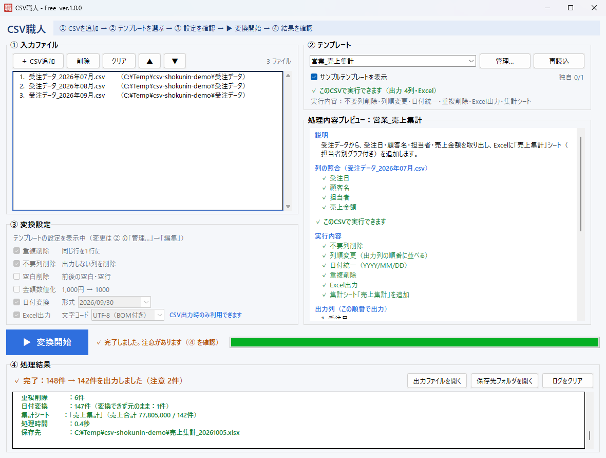

#  CSV職人

**毎日・毎月のCSV作業を、テンプレートを選んで「変換開始」を押すだけにする Windows 用ツールです。**

CSVの結合・不要な列の削除・日付や金額の書き方の統一・重複削除・Excel出力を、プログラミングなしで行えます。

## こんな作業が、ワンクリックになります

- 基幹システムから出した **毎月の売上CSVを3か月分つなげて**、担当者別の集計表（Excel）を作る
- 請求データから **必要な列だけ取り出して**、日付を `2026/09/30` 形式にそろえる
- 会計ソフトに取り込む前に、`1,000円`・`△500` のような金額を **半角数字にそろえる**
- 同じ顧客が何行も並んだ一覧から、**重複を1行にまとめる**

## 主な機能

| 機能 | 内容 |
|---|---|
| 業務テンプレート | 経理（請求・入金・会計連携）と営業（売上集計・顧客一覧・案件管理）の6種類を最初から収録。自分用のテンプレートも作れます |
| 実行前の確認 | テンプレートに必要な列がCSVにあるかを ✓／✗ で表示。足りない列があれば、変換前に知らせます |
| CSVの結合 | 複数のCSVを1つにまとめます（ドラッグ＆ドロップ・フォルダごとでも可） |
| データの加工 | 不要な列の削除・並べ替え・名前変更、空白削除、重複削除、日付の統一、金額の数値化 |
| Excel出力 | 見出し付き・列幅調整済みの xlsx で保存。売上集計では「売上集計」シート（合計・平均・担当者別グラフ）も自動で作成 |
| 文字コード | UTF-8・Shift_JIS を自動で判別。出力の文字コードも選べます |

**データを壊さない作り**：郵便番号や取引先コードの先頭の `0` は消えません。存在しない日付などの読めない値は変更せず、件数を知らせます。元のCSVは書き換えません。

## ダウンロードと起動

1. [**最新版のダウンロード（Releases）**](../../releases/latest) から `csv-shokunin-free-（版番号）.zip`（例：`csv-shokunin-free-1.0.0.zip`）をダウンロードします
2. ZIP を右クリック →「プロパティ」→ 下にある **「許可する」** にチェックを入れて OK を押します（下の青い画面が表示されにくくなります。表示されない PC もあります）
3. ZIP を右クリック →「すべて展開」で、好きな場所（ドキュメントなど）に解凍します
4. 解凍したフォルダの中の `csv-shokunin-free.exe` をダブルクリックで起動します

インストールは不要です。テンプレートや設定は自動で保存されるので、**exe を移動したり新しい版に置き換えたりしても、作ったテンプレートはそのまま使えます**。

**新しい版にするとき**：新しい ZIP の中の `csv-shokunin-free.exe` で、今の `csv-shokunin-free.exe` を上書きしてください。exe の名前は版が変わっても同じなので、作ったショートカットもそのまま使えます。

### 「Windows によって PC が保護されました」と表示された場合

インターネットからダウンロードしたばかりの exe を初めて起動すると、次のような青い画面が表示されることがあります。
これは CSV職人 にデジタル署名（発行元の証明）がまだ付いていないために表示されるもので、ウイルスが見つかったという意味ではありません。

> **Windows によって PC が保護されました**
>
> Microsoft Defender SmartScreen は認識されないアプリの起動を停止しました。…
>
> <u>詳細情報</u>
>
> ［実行しない］

**起動する手順**
1. 画面の中の **「詳細情報」** をクリックします
2. 下に **［実行］** ボタンが表示されるので、クリックします

2回目以降は表示されません。

- 会社のPCなどで［実行］ボタンが表示されない場合は、PCの管理者の設定で起動が制限されています。管理者にご相談ください
- 解凍する前に ZIP の「許可する」にチェックを入れておくと（上の手順 2）、この画面が表示されにくくなります
- ダウンロードした ZIP が壊れていないか・改ざんされていないかは、Releases に記載の SHA256 ハッシュ値で確認できます（PowerShell で `Get-FileHash ZIPのファイル名` を実行すると、比べる値が表示されます）
- 今後、デジタル署名を付けて、この画面が表示されないようにする予定です

## 使い方

画面の上部に、操作の流れ（① → ② → ③ → ▶ → ④）が表示されています。

1. **① 入力ファイル** に CSV を追加します（「＋ CSV追加」ボタン、またはドラッグ＆ドロップ）
2. **② テンプレート** で業務を選びます（例：営業_売上集計）。すぐ下に「✓ このCSVで実行できます」と表示されれば準備OKです
3. **③ 変換設定** を確認します（テンプレートを選ぶと、自動で設定されます）
4. **▶ 変換開始** を押して、保存先を選びます
5. **④ 処理結果** で件数を確認し、「出力ファイルを開く」で結果を開きます

テンプレートを使わずに、③ の変換設定を自分で選んで変換することもできます。
詳しい使い方は [使い方ガイド](docs/USER_GUIDE.md) を参照してください。

### サンプルデータで試す
各テンプレート用のサンプルCSV（架空のデータ）を、ZIP の中の `sample_data\テンプレート体験用\` に用意しています。
フォルダごと ① にドラッグ＆ドロップし、フォルダ名と同じテンプレートを選んで変換してみてください。

## 無料版について

| 項目 | 無料版 |
|---|---|
| サンプルテンプレート（6種類） | 使えます |
| 自分で作るテンプレート（独自テンプレート） | **1件まで保存できます** |
| CSVの変換・Excel出力 | 制限なし |

- 使わないサンプルは「サンプルテンプレートを表示」のチェックを外すと非表示にできます
- 独自テンプレートが1件ある状態で新しく保存すると、今のテンプレートをバックアップしてから置き換えるかどうかを確認します
- 「1件まで」は、**新しく保存・インポート・複製するときの上限**です。すでにあるテンプレートは、件数が上限を超えていても、そのまま表示・使用・編集でき、自動で削除されたり使えなくなったりすることはありません

## 動作環境

| 項目 | 内容 |
|---|---|
| OS | Windows 10・Windows 11（64ビット）で動作を確認しています |
| 画面 | 1366×768 以上（表示倍率 100%〜150%） |
| その他 | インストール不要・インターネット接続不要 |

## よくある質問

**Q. 作ったテンプレートはどこに保存されますか？**
`%LOCALAPPDATA%\csv-shokunin\` に保存されます（エクスプローラーのアドレス欄に貼り付けると開けます）。exe とは別の場所なので、exe を移動・更新しても消えません。

**Q. 別のPCでも同じテンプレートを使いたい**
テンプレート管理（② の「管理…」）の「エクスポート」で JSON ファイルに書き出し、別のPCで「インポート」してください。

**Q. アンインストールするには？**
解凍したフォルダ（`csv-shokunin-free.exe` が入っているフォルダ）を削除してください。テンプレートや設定も消す場合は、`%LOCALAPPDATA%\csv-shokunin\` フォルダも削除します。

**Q. うまく動かないときは？**
`%LOCALAPPDATA%\csv-shokunin\logs\app.log` に動作の記録が残っています。[お問い合わせ](#お問い合わせ)の際に添えていただくと、原因を調べやすくなります。

## 利用規約・ライセンス

- CSV職人 は、[利用規約（EULA.txt）](EULA.txt) に同意のうえでご利用ください。個人・法人・商用を問わず無料で使えます。再配布・転売・改変版の配布・リバースエンジニアリングは禁止しています
- CSV職人 に含まれる第三者のソフトウェア（Python、openpyxl など）の著作権表示とライセンスは [THIRD_PARTY_NOTICES.txt](THIRD_PARTY_NOTICES.txt) に記載しています
- どちらのファイルも、配布用の ZIP に同梱しています

## お問い合わせ

ご質問・不具合のご報告・ご要望は、[お問い合わせフォーム](https://forms.gle/YAcyhDnC36RKScoG6) からお寄せください（GitHub のアカウントをお持ちの方は、[Issues](../../issues) でも受け付けています）。

- 不具合のご報告には、CSV職人 の版（画面のタイトルに表示）、Windows の版、操作の手順、表示されたメッセージを書いていただくと、原因を調べやすくなります
- ログファイル（`%LOCALAPPDATA%\csv-shokunin\logs\app.log`）を添えていただくと、さらに調べやすくなります（フォームではファイルを受け取れないため、必要なときにこちらからご連絡します）。ログには CSV のファイル名や保存場所（Windows のユーザー名を含むことがあります）が記録されているので、見られて困る部分は消してから添えてください
- Issues は誰でも見られる場所です。お客様の名前・金額など、**CSVの中身や個人情報は書き込まないでください**

## ドキュメント

| 資料 | 内容 |
|---|---|
| [使い方ガイド](docs/USER_GUIDE.md) | 画面の詳しい説明・テンプレート管理・エラー表示 |
| [テンプレート作成ガイド](docs/TEMPLATE_GUIDE.md) | テンプレートを JSON で書く方法 |
| [更新履歴](CHANGELOG.md) | 版ごとの変更点 |
| [今後の予定](docs/ROADMAP.md) | 今後追加を検討している機能 |
