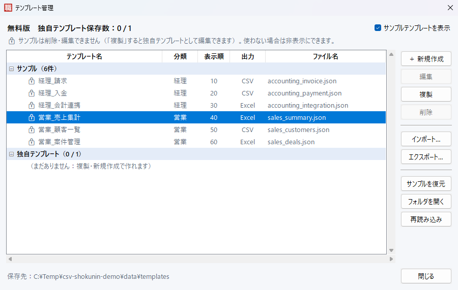

# CSV職人 使い方ガイド

[README](../README.md) の「使い方」より詳しい説明です。

## 1. 画面の見かた


画面の上部に操作の流れ（① → ② → ③ → ▶ → ④）を表示しています。

| 場所 | 表示される内容 |
|---|---|
| 上部 | 操作の流れ（① CSVを追加 → ② テンプレートを選ぶ → ③ 設定を確認 → ▶ 変換開始 → ④ 結果を確認） |
| 設定エリア・左（画面の約7割） | ① 入力ファイル ／ ③ 変換設定 |
| 設定エリア・右（画面の約7割） | ② テンプレート（「✓ このCSVで実行できます」）／ 処理内容プレビュー（説明・列の照合・実行内容・出力列） |
| 下部（画面の約3割・常に表示） | ▶ 変換開始・準備状況（「✓ 準備OK」など）・進み具合のバー ／ ④ 処理結果（件数・保存先・注意） |

1. **① 入力ファイル** に CSV を追加します（「＋ CSV追加」ボタン、またはファイル一覧へドラッグ＆ドロップ。フォルダごとでも可。一覧が空のときは一覧をクリックしても選べます）
2. **② テンプレート** で業務を選びます（例：営業_売上集計）。すぐ下に「✓ このCSVで実行できます」または「✗ 必要な列が見つかりません」と表示されます
3. **③ 変換設定** を確認します（テンプレート使用中はテンプレートの設定を表示）
4. **▶ 変換開始** を押し、保存先を選びます。ボタンの横には、次にすべきこと（「まず ① に CSV を追加」「✓ 準備OK」など）が常に表示されます
5. **④ 処理結果** で件数・注意・保存先を確認し、「出力ファイルを開く」で結果を開けます

- テンプレートを「なし」にすると、③ でチェックした内容で処理します（手動で選んだ設定は、テンプレートから戻したときに復元されます）
- テンプレートを選ぶと、すぐ下の **処理内容プレビュー** に、テンプレートの説明・列の照合結果・実行内容・出力列・削除対象などが表示されます
- 手動設定のときは、同じ場所に **列の設定**（削除・並べ替え・名前変更）ボタンが表示されます

### 小さい画面・表示倍率への対応
- ウィンドウは、タスクバーを除いた画面の範囲に収まる大きさで開きます
- **▶ 変換開始** と **④ 処理結果** は画面下部（約3割）に固定され、常に表示されます
- 処理内容プレビューの内容が多い場合は、プレビューの中だけがスクロールします
- 確認した環境：1366×768（100%・125%）、1920×1080（100%・125%・150%）
- 1366×768・125% では処理結果のログ欄は約1行になります（結果の要約「✓ 完了：〇件 → 〇件」は常に表示）

## 2. テンプレート管理



② テンプレートの **管理…** から開きます。

| 操作 | 内容 |
|---|---|
| 新規作成 | 画面の入力欄で作成（「CSV から列名を読み込む」で列名を自動入力できる） |
| 編集 | ダブルクリックでも開けます（独自テンプレートのみ） |
| 複製 | 「〇〇（コピー）」を作成。サンプルを元に自分用のテンプレートを作るときに使います |
| 削除 | 確認のうえ削除（独自テンプレートのみ。サンプルは削除できません） |
| インポート／エクスポート | JSON ファイルで他の PC と共有。同じ ID がある場合は「上書き／別名で追加」を選べる |
| サンプルを復元 | 見つからないサンプルだけ戻す／すべてのサンプルを元の内容に戻す（独自テンプレートには影響なし） |

テンプレートを JSON で直接書きたい場合は [テンプレート作成ガイド](TEMPLATE_GUIDE.md) を参照してください。

## 3. 無料版の制限（独自テンプレートは1件まで）

| 種別 | 内容 | 保存数の制限 |
|---|---|---|
| 🔒 サンプル | アプリ同梱の6種類（経理_請求 など）。複製はできます。削除・編集はできません | 対象外 |
| 独自 | 新規作成・複製・インポートしたテンプレート | 無料版は **1件まで** |

- 保存数は **独自テンプレートだけ** で数えます。テンプレート管理画面の上部（「無料版　独自テンプレート保存数：1 / 1」）と、② テンプレートの右（「独自 1/1」）に表示されます
- 使わないサンプルは「サンプルテンプレートを表示」をオフにすると非表示にできます（メイン画面の ② とテンプレート管理画面のどちらからでも切り替えられます。次回起動時も前回の状態で表示されます）
- すでに1件保存している状態で新しく保存・インポートすると、置換確認が表示されます
  - **バックアップして置換**：今のテンプレートを JSON に書き出してから置き換えます
  - **そのまま置換**：今のテンプレートを新しいテンプレートで置き換えます
  - **キャンセル**：何も変更しません
- 置き換えは「新しいテンプレートの保存に成功してから、古いテンプレートを削除」の順で行います。失敗したときは、今のテンプレートは削除されません
- 今ある独自テンプレートの編集は、制限に関係なくいつでも保存できます

**「1件まで」は保存の上限です（読み込みの上限ではありません）**
- 独自テンプレートが上限より多くある場合（例：テンプレートのフォルダに JSON ファイルを複数置いた場合）も、**すべて一覧に表示され、選んで使え、編集もできます**
- 新しく保存・インポート・複製して件数を増やそうとしたときだけ、「無料版では保存できる独自テンプレートは1件までです。…不要な独自テンプレートを削除してから、もう一度お試しください。」と表示して保存を中止します
- テンプレートが自動で削除されたり、使えなくなったりすることはありません。不要なものを自分で削除して1件以内にすれば、また新しく保存できます

## 4. 使えない設定はグレーアウト
今は使えない設定は、非表示にせずグレーアウトし、横に理由を表示します。マウスを重ねると、使えない理由をツールチップで表示します。

| 場所 | 条件 | グレーアウトする設定 | 表示される理由 |
|---|---|---|---|
| ③ 変換設定 | Excel出力がオン | 文字コード | CSV出力時のみ利用できます |
| ③ 変換設定 | 日付変換がオフ | 日付の形式 | 「日付変換」にチェックすると選べます |
| ③ 変換設定 | テンプレート使用中 | すべてのチェック | テンプレートの設定です（変更は ② の「管理…」→「編集」） |
| テンプレート管理 | サンプルを選択中 | 編集・削除 | サンプルは削除・編集できません |
| テンプレート編集 | 出力形式が Excel | CSV文字コード | CSV出力時のみ利用できます |
| テンプレート編集 | 出力形式が CSV | 集計シートの設定一式 | Excel出力を選択すると利用できます |
| テンプレート編集 | 集計シートがオフ | シート名・金額の列など | 「集計シートを追加する」にチェックすると入力できます |

## 5. データを壊さないための工夫
- **先頭のゼロを消しません**：郵便番号・社員番号・取引先コード（`00123`）も元のまま残ります
- **Excel で計算できます**：`100` や `12,500` のような数値は Excel に「数値」として保存するので、`SUM` などがそのまま使えます
- **読めない値は変更しません**：存在しない日付（`2026/09/31`）や金額として読めない値（`未定`）は元のまま残し、件数と例を表示します
- **実行前に確認できます**：テンプレートに必要な列が CSV に無い場合は、保存先を選ぶ前に「見つからない列」を表示して止まります
- **元のファイルを守ります**：読み込んだ CSV を保存先にはできません。保存は一時ファイル経由なので、失敗しても既存のファイルは壊れません

## 6. エラー表示

| 状況 | 表示される内容（例） |
|---|---|
| ファイル未選択 | 「CSV ファイルが選択されていません。」＋追加方法 |
| 列数不一致 | 基準ファイルの列数と、列数が違うファイルの一覧 |
| 文字コードエラー | 判別できないファイル名＋「CSV UTF-8」で保存し直す手順 |
| 出力失敗 | Excel で開いたままのファイル、書き込み権限、Excel の行数上限など |
| テンプレートと列が一致しない | 見つからない列・CSV の列一覧＋別名（aliases）の追加方法 |
| テンプレート JSON の間違い | 行・文字の位置、打ち間違いの候補（「もしかして remove_duplicates？」）。他のテンプレートは通常どおり使える |

## 7. 保存場所

```text
%LOCALAPPDATA%\csv-shokunin\        ← CSV職人 の保存領域
├ templates\             テンプレート（初回起動時にサンプル6件を配置）
├ settings\settings.json 画面の設定（サンプル表示ON/OFF など）
├ logs\app.log           ログ（問い合わせの際に役立ちます）
└ backups\               バックアップ用（今後の機能で使用）
```

- exe をどこに置いても、移動しても、新しい版に置き換えても、同じテンプレートが使えます